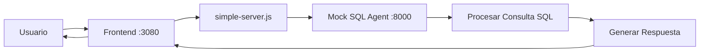

# 🗃️ Asistente SQL - Frontend de Chat

> **Frontend de chat similar a ChatGPT diseñado específicamente para consultas SQL y análisis de bases de datos**


## 🚀 **Inicio Rápido**

### **1. Clonar el Repositorio**
```bash
git clone [URL_DEL_REPO]
cd LibreChat
```

### **2. Instalar Dependencias**
```bash
npm install
```

### **3. Iniciar el Sistema**

**Opción A: Script Automático (Windows)**
```bash
dev-start.bat
```

**Opción B: Manual**
```bash
# Terminal 1: Iniciar Mock SQL Agent
node mock-sql-agent.js

# Terminal 2: Iniciar Frontend
node simple-server.js
```

### **4. Acceder a la Aplicación**
```
🌐 Frontend: http://localhost:3080
📡 SQL Agent: http://localhost:8000/health
```

---

## 📋 **Características Principales**

### ✨ **Interfaz de Usuario**
- 💬 **Chat similar a ChatGPT** optimizado para consultas SQL
- 🎨 **Diseño corporativo** con colores rojo, negro y blanco
- 📱 **Responsive Design** funciona en desktop y móvil
- ⚡ **Respuestas en tiempo real** con SQL generado

### 🔧 **Funcionalidades Técnicas**
- 🗃️ **Consultas SQL en lenguaje natural**
- 📊 **Análisis de resultados** con estadísticas
- 🔍 **Ejemplos predefinidos** para usuarios, ventas, inventario
- 🚀 **Mock Agent** incluido para testing
- 🔒 **APIs REST** completas y documentadas

---

## 🛠️ **Estructura del Proyecto**

```
LibreChat/
├── 📄 simple-server.js              # Servidor principal del frontend
├── 🤖 mock-sql-agent.js            # Simulador del agente SQL
├── 🎨 public/index.html             # Interfaz de chat
├── ⚙️  api/app/clients/SQLAgentClient.js  # Cliente SQL personalizado
├── 📋 librechat-sql-agent.yaml     # Configuración del sistema
├── 🚀 dev-start.bat                # Script de inicio automático
└── 📚 README-SQL-ASSISTANT.md      # Esta documentación
```

---

## 🔄 **Flujo de Funcionamiento**



---

## 💻 **Ejemplos de Uso**

### **Consultas que puedes hacer:**

1. **👥 Gestión de Usuarios**
   ```
   "Muéstrame todos los usuarios registrados"
   "¿Cuántos usuarios hay activos?"
   ```

2. **💰 Análisis de Ventas**
   ```
   "¿Cuáles fueron las ventas del último mes?"
   "Muestra el reporte de ingresos por día"
   ```

3. **📦 Control de Inventario**
   ```
   "Revisa el estado del inventario"
   "¿Qué productos tienen stock bajo?"
   ```

4. **🔧 Operaciones CRUD**
   ```
   "Crear un nuevo usuario con email juan@email.com"
   "Actualizar el precio del producto ID 123"
   "Eliminar registros antiguos de la tabla logs"
   ```

---

## ⚙️ **Configuración Avanzada**

### **Variables de Entorno**
Edita `config.env` para personalizar:

```env
# Puerto del frontend
PORT=3080

# URL del agente SQL real
SQL_AGENT_API_URL=http://localhost:8000
SQL_AGENT_API_KEY=tu-api-key-aqui

# Configuración de desarrollo
NODE_ENV=development
DEBUG_LOGGING=true
```

### **Conectar tu Agente SQL Real**

1. **Reemplaza el Mock Agent:**
   - Cambia `SQL_AGENT_API_URL` en `config.env`
   - Actualiza `SQL_AGENT_API_KEY` con tu clave real

2. **Tu agente debe implementar:**
   ```bash
   POST /chat
   GET /health
   GET /schema (opcional)
   ```

---

## 🔧 **Desarrollo y Personalización**

### **Modificar la Interfaz**
- **Colores**: Edita `client/src/style.css`
- **Mensajes**: Modifica `public/index.html`
- **Logo**: Reemplaza archivos en `client/public/assets/`

### **Agregar Nuevas Funcionalidades**
- **Endpoints**: Edita `simple-server.js`
- **Respuestas Mock**: Modifica `mock-sql-agent.js`
- **Cliente SQL**: Personaliza `api/app/clients/SQLAgentClient.js`

### **Scripts Disponibles**
```bash
npm run backend:dev     # Modo desarrollo LibreChat original
npm run frontend:dev    # Frontend original LibreChat
node simple-server.js   # Nuestro servidor simplificado
node mock-sql-agent.js  # Mock del agente SQL
```

---

## 🚨 **Solución de Problemas**

### **Puerto 3080 ocupado**
```bash
# Cambiar puerto en simple-server.js
const PORT = process.env.PORT || 3081;
```

### **Mock Agent no responde**
```bash
# Verificar que esté corriendo
curl http://localhost:8000/health

# Reiniciar si es necesario
node mock-sql-agent.js
```

### **Error "Cannot find module"**
```bash
# Reinstalar dependencias
rm -rf node_modules
npm install
```

---

## 📦 **Despliegue en Producción**

### **Opción 1: PM2** (Recomendado)
```bash
npm install -g pm2
pm2 start simple-server.js --name "sql-assistant"
```

### **Opción 2: Servidor Manual**
```bash
NODE_ENV=production node simple-server.js
```

---

## 🤝 **Contribuir**

1. **Fork** el repositorio
2. **Crea** una rama para tu feature (`git checkout -b feature/nueva-funcionalidad`)
3. **Commit** tus cambios (`git commit -m 'Add: nueva funcionalidad'`)
4. **Push** a la rama (`git push origin feature/nueva-funcionalidad`)
5. **Crea** un Pull Request

---

## 📞 **Soporte**

- 📧 **Email**: [tu-email@empresa.com]
- 💬 **Chat**: Abre un issue en el repositorio
- 📖 **Docs**: Revisa este README y los comentarios del código

---

## 📄 **Licencia**

Este proyecto está basado en [LibreChat](https://github.com/danny-avila/LibreChat) y mantiene la licencia MIT.

---

## ⭐ **Reconocimientos**

- **LibreChat Team** por la base del proyecto
- **Express.js** por el framework del servidor
- **Equipo de desarrollo** por la implementación personalizada

---

### 🎯 **Estado del Proyecto: ✅ FUNCIONAL**

```
✅ Frontend de chat implementado
✅ Mock SQL Agent funcionando  
✅ APIs REST completas
✅ Diseño responsive
✅ Documentación completa
✅ Scripts de inicio automático
🔄 Listo para integrar agente SQL real
```

**¡Happy Coding! 🚀**
